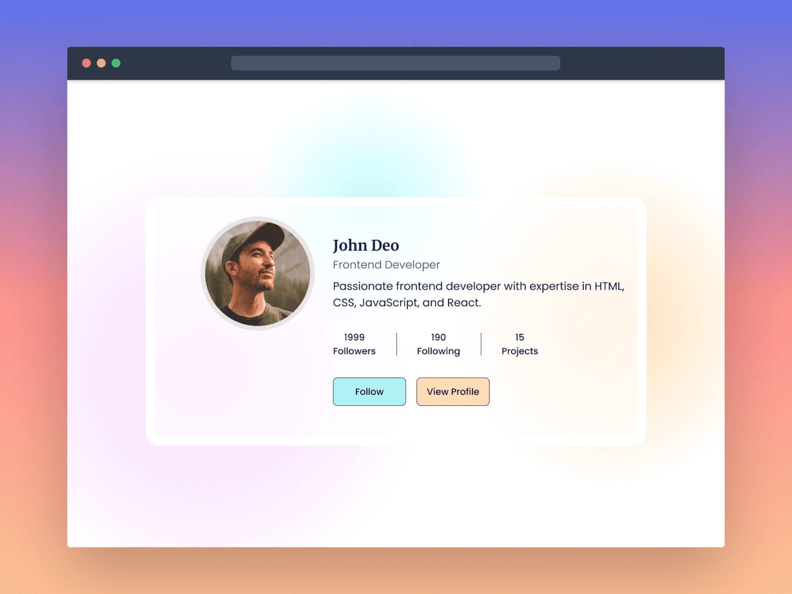

**Challenge Title**
Profile Card Component

**Challenge Description**
In this challenge, I built a Profile Card Component. The challenge ws perfect for me to learn and get experience in building front-end web components as well as taking my front-end skills to the next level!

**Difficulty Level**
Beginner

**Tags**
FRONTEND

**Requirements**

- The component should display a profile image, name, job title, and a short bio.
- The component should display the number of followers, following and projects completed.
- The component should have two buttons: View Profile & Follow
- The component should be responsive and display correctly on different screen sizes.
- Make this landing page look as close to the design as possible.

I enjoyed building this challenge.

